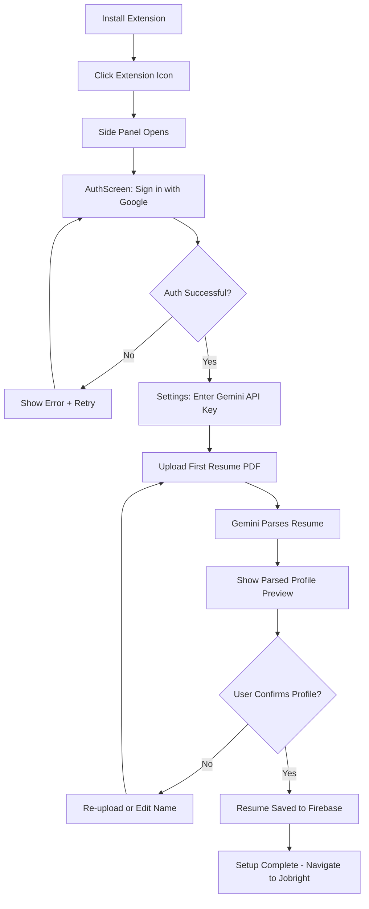
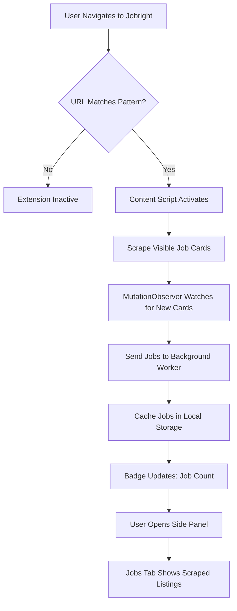
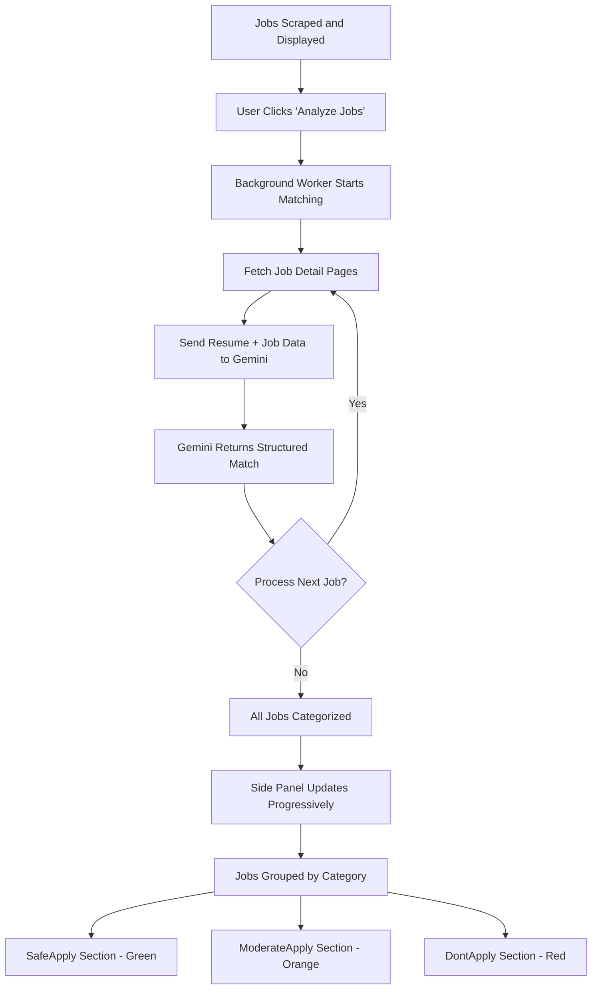
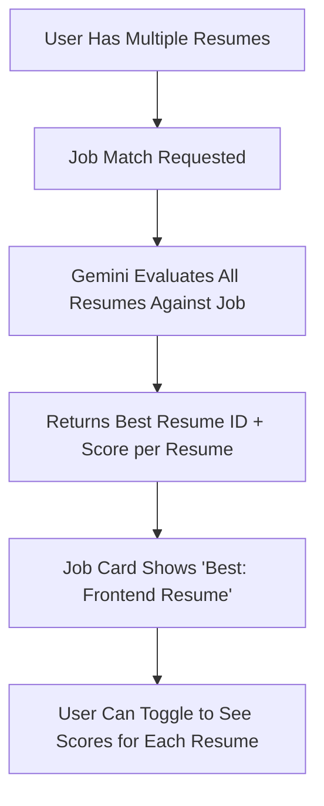
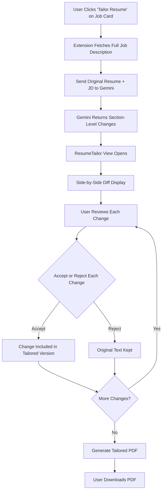
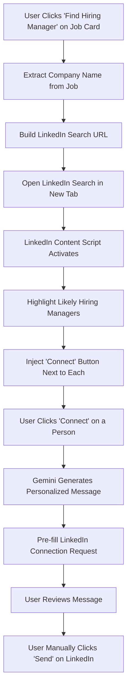
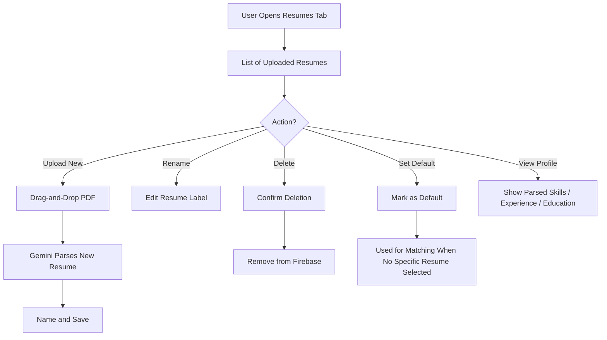
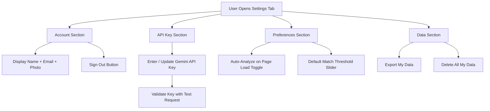
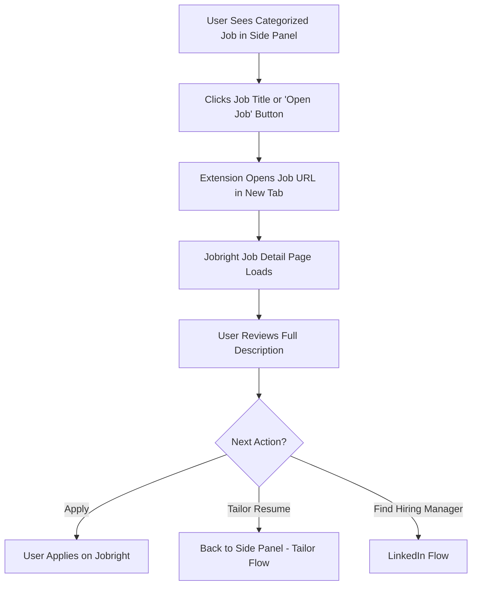

# HireExtension - User Flow Document

## 1. First-Time Setup Flow

### Step-by-step

1. User installs HireExtension from the browser's extension store.
2. User clicks the extension icon in the toolbar. The side panel opens showing the auth screen.
3. User clicks "Sign in with Google". A Google OAuth popup appears.
4. Upon successful sign-in, the user is prompted to enter their Gemini API key (with a link to Google AI Studio to get one).
5. User uploads their first resume (PDF). A drag-and-drop zone and file picker are both available.
6. The extension sends the PDF to Gemini API for parsing. A loading spinner shows progress.
7. The parsed profile (skills, experience, education) is displayed for review.
8. User confirms the parsed profile is accurate, optionally gives the resume a name (e.g., "Frontend Resume").
9. Resume metadata is saved to Firestore; PDF is uploaded to Firebase Storage.
10. The side panel shows a success message and prompts the user to navigate to Jobright.ai.

---

## 2. Job Scanning Flow

### Step-by-step

1. User navigates to `jobright.ai/jobs/*` (search results) or `jobright.ai/recommend*` (recommended jobs).
2. The content script detects the matching URL and activates.
3. All visible job cards on the page are scraped: title, company, location, salary, URL, etc.
4. A `MutationObserver` watches the DOM for newly loaded job cards (infinite scroll).
5. Scraped job data is sent to the background service worker via `chrome.runtime.sendMessage`.
6. Jobs are cached in `chrome.storage.local` to persist across panel opens/closes.
7. The extension badge updates to show the number of scraped jobs (e.g., "24").
8. When the user opens the side panel, the Jobs tab displays all scraped listings.

---

## 3. Job Matching and Categorization Flow

### Step-by-step

1. After jobs are scraped, the user clicks "Analyze Jobs" in the side panel (or analysis starts automatically).
2. The background worker begins processing jobs in batches of 3-5.
3. For each job, the extension fetches the full job description from the detail page URL.
4. The job description + user's parsed resume profile(s) are sent to Gemini API.
5. Gemini returns a structured JSON response: match score, category, reasons, missing skills, and recommended resume.
6. The side panel updates progressively as each job is categorized (no need to wait for all).
7. Jobs are grouped into three sections:
   - **Safe Apply** (green badge, score 75-100): "You're a strong match"
   - **Moderate Apply** (orange badge, score 50-74): "Good fit with some gaps"
   - **Don't Apply** (red badge, score 0-49): "Significant mismatch"
8. Each job card shows: score, category badge, recommended resume name, and top reasons.

---

## 4. Multi-Resume Recommendation Flow

### Step-by-step

1. User has uploaded multiple resumes (e.g., "Frontend Resume" and "Fullstack Resume").
2. When a job is analyzed, Gemini receives all resume profiles and evaluates each one.
3. The response includes the recommended resume ID and individual scores.
4. The job card displays a label: "Best match: Frontend Resume (82%)".
5. User can expand the card to see how each resume scored against the job.
6. This helps users decide which resume to submit for each application.

---

## 5. Resume Tailoring Flow

### Step-by-step

1. On any job card, user clicks the "Tailor Resume" button.
2. The extension fetches the full job description (if not already cached).
3. The original resume (PDF or parsed text) and job description are sent to Gemini.
4. Gemini returns a list of suggested changes per section (summary, experience bullets, skills ordering). It does NOT add skills or experience the user doesn't have.
5. The `ResumeTailor` view opens showing a side-by-side diff:
   - Left: original text
   - Right: suggested tailored text
   - Changes are highlighted
6. User reviews each change individually and can accept or reject it.
7. Once review is complete, the extension generates a tailored PDF with only the accepted changes.
8. User downloads the tailored PDF. The original resume remains untouched in storage.

---

## 6. LinkedIn Hiring Manager Finder Flow

### Step-by-step

1. On a job card, user clicks "Find Hiring Manager".
2. The extension extracts the company name and job domain from the listing.
3. A LinkedIn People Search URL is constructed: `linkedin.com/search/results/people/?keywords={company} hiring manager {domain}`.
4. The URL opens in a new browser tab.
5. The content script on LinkedIn activates and scans the search results.
6. People with titles like "Hiring Manager", "Recruiter", "Talent Acquisition", "Engineering Manager" at the target company are highlighted.
7. A small "Connect via HireExtension" button is injected next to highlighted profiles.
8. When clicked, Gemini generates a personalized connection message using the user's profile and the job details.
9. The message is pre-filled into LinkedIn's "Add a note" field of the connection request dialog.
10. The user reviews the message, edits if desired, and manually clicks LinkedIn's "Send" button.
11. The extension never auto-sends -- the user is always in control.

---

## 7. Resume Management Flow

### Step-by-step

1. User navigates to the "Resumes" tab in the side panel.
2. All uploaded resumes are listed with their name, upload date, and a "Default" badge on the active default.
3. **Upload**: User drags a PDF or clicks to browse. Gemini parses it, user names it, it's saved.
4. **Rename**: User clicks the name to edit it inline (e.g., "Resume v2" to "Backend Engineer Resume").
5. **Delete**: User clicks delete, confirms in a dialog. The PDF and metadata are removed from Firebase.
6. **Set Default**: User clicks "Set as Default". This resume is used when matching jobs with no specific resume selected.
7. **View Profile**: User clicks to expand and see the parsed skills, experience timeline, and education.

---

## 8. Settings and Account Flow

### Step-by-step

1. User opens the "Settings" tab in the side panel.
2. **Account**: Shows Google account info (name, email, photo). "Sign Out" button logs out and clears local session.
3. **API Key**: Input field for Gemini API key. On save, a test request validates the key. Success/failure feedback shown.
4. **Preferences**:
   - Toggle for auto-analyzing jobs when a Jobright page loads (vs. manual "Analyze" button).
   - Slider to adjust the score thresholds for Safe/Moderate/Don't Apply categories.
5. **Data Management**:
   - "Export My Data": Downloads all resumes, match history, and settings as a ZIP.
   - "Delete All My Data": Removes everything from Firebase and local storage after confirmation.

---

## 9. Opening a Job Link Flow

### Step-by-step

1. In the side panel, each job card has a clickable title and an "Open Job" button.
2. Clicking either opens the Jobright job detail page in a new browser tab.
3. The user can read the full job description, requirements, and company info.
4. From there, the user can apply directly on Jobright, or return to the side panel to tailor their resume or find the hiring manager.

---

## 10. End-to-End Happy Path

**Total time from install to first categorized job list: under 3 minutes.**
